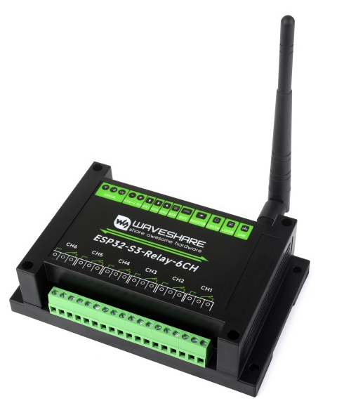
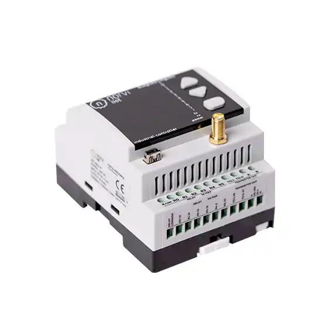
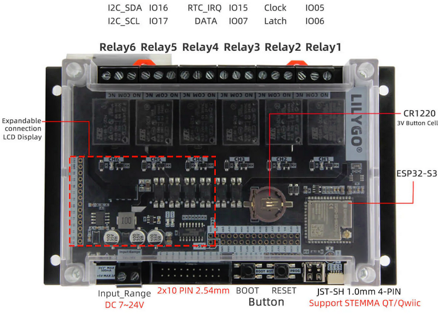
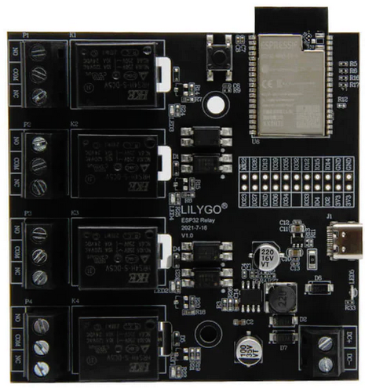
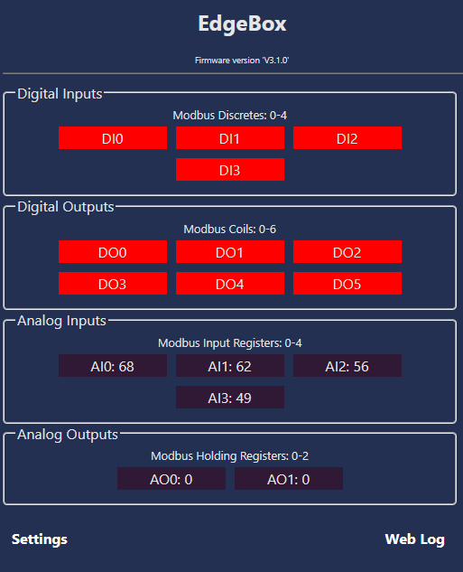
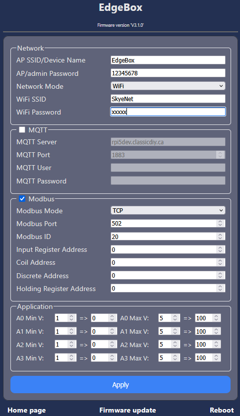

# ESP_PLC
<a href="https://www.buymeacoffee.com/r4K2HIB" target="_blank"></a>


 Simple gpio to modbus server with MQTT support. 

 Implementations available for;
 
 <a href="https://www.seeedstudio.com/EdgeBox-ESP-100-p-5490.html" target="_blank" rel="noopener noreferrer">SeedStudio EdgeBox-ESP-100</a>.</p>
 <a href="https://norvi.io/norvi-iiot-esp32-industrial-controller" target="_blank" rel="noopener noreferrer">Norvi ESP32 Industrial Controllers</a>.</p>
 <a href="https://www.waveshare.com/esp32-s3-relay-6ch.htm" target="_blank" rel="noopener noreferrer">Waveshare Industrial 6-Channel ESP32-S3 WiFi Relay Module</a>.</p>
 <a href="https://lilygo.cc/products/t-relay-s3" target="_blank" rel="noopener noreferrer">Lilygo T-Relay-S3 6-Channel ESP32-S3 WiFi Relay Module</a>.</p>
 <a href="https://lilygo.cc/products/t-relay" target="_blank" rel="noopener noreferrer">Lilygo T-Relay 4-Channel ESP32 WiFi Relay Module</a>.</p>


<p align="left">
 
 
 
 
 
</p>

<p><li>Use Wifi Access Point, default AP: ESP_PLC, default PW: 12345678. Browse 192.168.4.1 and go to Settings Page to configure.</li><p>
<p><li>Supported Network configurations: Wifi, Ethernet, 4G modem.</li></p>
<p><li>You must have a SIM with a static IP to be able to access the modbus server over the 4g network.</li></p>

## Home Page
<p align="center">
  
</p>

## Settings Page
<p align="center">
  
</p>

## License
```

 Copyright (c) 2025. ClassicDIY

  Unless required by applicable law or agreed to in writing, software
  distributed under the License is distributed on an "AS IS" BASIS,
  WITHOUT WARRANTIES OR CONDITIONS OF ANY KIND, either express or implied.
  See the License for the specific language governing permissions and
  limitations under the License.

```
