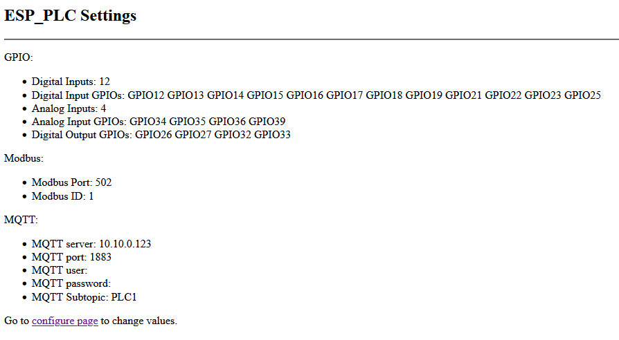
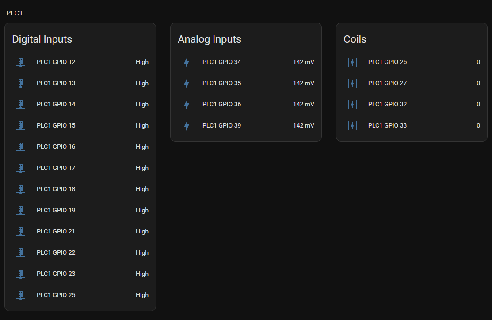

# ESP_PLC
 Simple gpio to modbus server with MQTT support

[](https://hits.seeyoufarm.com)

[](https://github.com/ClassicDIY/FloatLevel/stargazers)

<a href="https://www.buymeacoffee.com/r4K2HIB" target="_blank"></a>

<p align="left">
  
</p>
<p align="left">
  
</p>

Used the following development tools;

<ul>
  <li>Visual Studio Code with the PlatformIO extension.</li>
  <li>Setup WIFI configuration by logging onto the "FloatLevel" Access Point, use the admin default pw: 12345678 as the AP password. Browse 192.168.4.1 and go to Configuration Page to provide your WIFI credentials.
</ul>


## License
```

 Copyright (c) 2025. ClassicDIY

  Unless required by applicable law or agreed to in writing, software
  distributed under the License is distributed on an "AS IS" BASIS,
  WITHOUT WARRANTIES OR CONDITIONS OF ANY KIND, either express or implied.
  See the License for the specific language governing permissions and
  limitations under the License.

```
